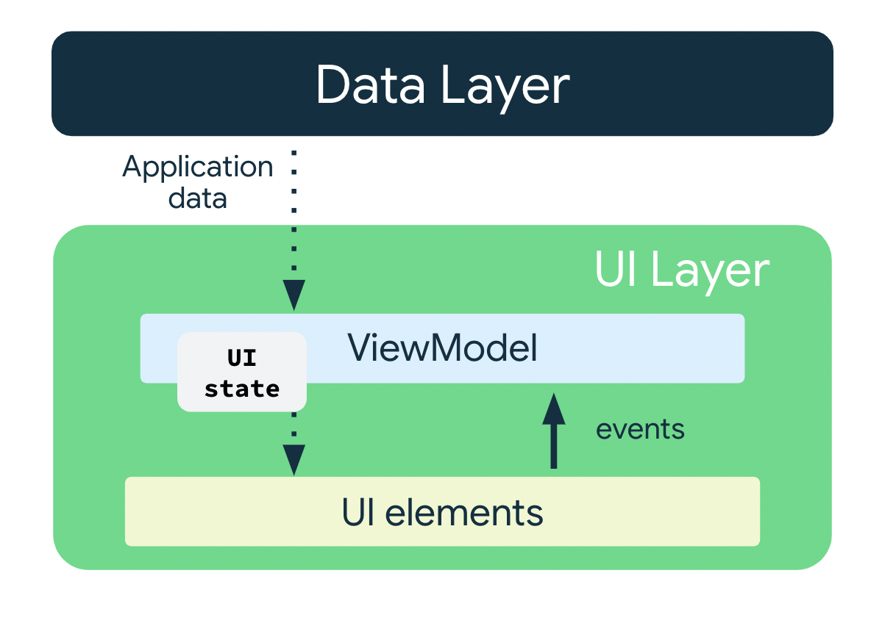
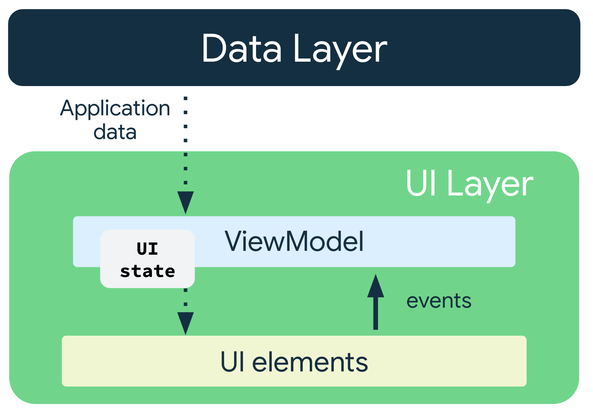

Unscramble app
=================================

Single player game app that displays scrambled words. To play the game, player has to make a
word using all the letters in the displayed scrambled word.
This code demonstrates the Android Architecture component- ViewModel and StateFlow.
**Key Learning : **

1. **Basics of App Architecture:** 
        An app's architecture provides guidelines to help you allocate the app responsibilities between the classes. The most common architectural principles are separation of concerns and
       driving UI from a model.
        
          a) Separation of concerns: The separation of concerns design principle states that the app is divided into classes of functions, each with separate responsibilities.
        
          b) Drive UI from a model: The drive UI from a model principle states that you should drive your UI from a model, preferably a persistent model. Models are components responsible
                                     for handling the data for an app. They're independent from the UI elements and app components in your app, so they're unaffected by the app's lifecycle                                     and associated concerns.

2. **UI State:**
The UI is what the user sees, and the UI state is what the app says they should see. The UI is the visual representation of the UI state. Any changes to the UI state immediately are reflected in the UI.

                                                                 

4. **Immutability** : Immutable objects provide guarantees that multiple sources do not alter the state of the app at an instant in time. This protection frees the UI to focus on a single role: reading state and updating UI elements accordingly. Therefore, you should never modify the UI state in the UI directly, unless the UI itself is the sole source of its data. Violating this principle results in multiple sources of truth for the same piece of information, leading to data inconsistencies and subtle bugs.
   Example : 
             data class NewsItemUiState(
              val title: String,
              val body: String,
              val bookmarked: Boolean = false,
              ...
          )

5. **StateFlow** :
   StateFlow is a data holder observable flow that emits the current and new state updates. Its value property reflects the current state value. To update state and send it to the flow, assign a new value to the value property of the MutableStateFlow class.

In Android, StateFlow works well with classes that must maintain an observable immutable state.

**4.1 Backing Property**: 
A backing property lets you return something from a getter other than the exact object.

For **var** property, the Kotlin framework generates getters and setters.

For getter and setter methods, you can override one or both of these methods and provide your own custom behavior. To implement a backing property, you override the getter method to return a read-only version of your data. The following example shows a backing property:

            **//Example code, no need to copy over
            
            // Declare private mutable variable that can only be modified
            // within the class it is declared.
            private var _count = 0 
            
            // Declare another public immutable field and override its getter method. 
            // Return the private property's value in the getter method.
            // When count is accessed, the get() function is called and
            // the value of _count is returned. 
            val count: Int
                get() = _count**
As another example, say that you want the app data to be private to the ViewModel:

    Inside the ViewModel class:
    
    The property _count is private and mutable. Hence, it is only accessible and editable within the ViewModel class.
    Outside the ViewModel class:
    
    The default visibility modifier in Kotlin is public, so count is public and accessible from other classes like UI controllers. A val type cannot have a setter. It is immutable and read-
    only so you can only override the get() method. When an outside class accesses this property, it returns the value of _count and its value can't be modified. This backing property 
    protects the app data inside the ViewModel from unwanted and unsafe changes by external classes, but it lets external callers safely access its value.
    
**5. Unidirectional data flow :**
A unidirectional data flow (UDF) is a design pattern in which state flows down and events flow up. By following unidirectional data flow, you can decouple composables that display state in the UI from the parts of your app that store and change state.

    

    The use of the UDF pattern for app architecture has the following implications:
    
    1. The ViewModel holds and exposes the state the UI consumes.
    2. The UI state is application data transformed by the ViewModel.
    3. The UI notifies the ViewModel of user events.
    4. The ViewModel handles the user actions and updates the state.
    5. The updated state is fed back to the UI to render.
    6. This process repeats for any event that causes a mutation of state.
